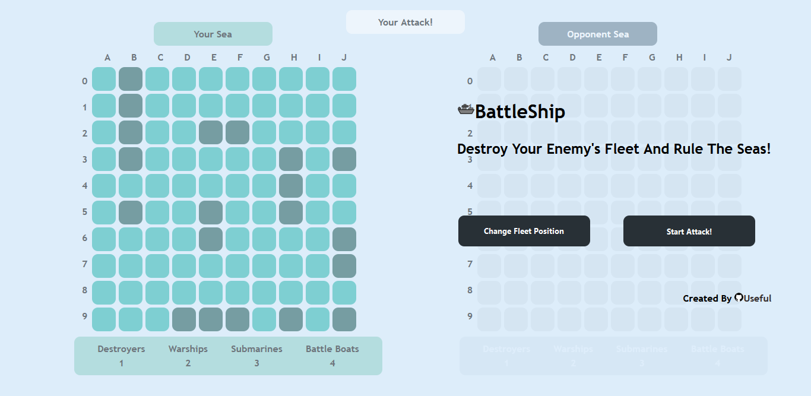
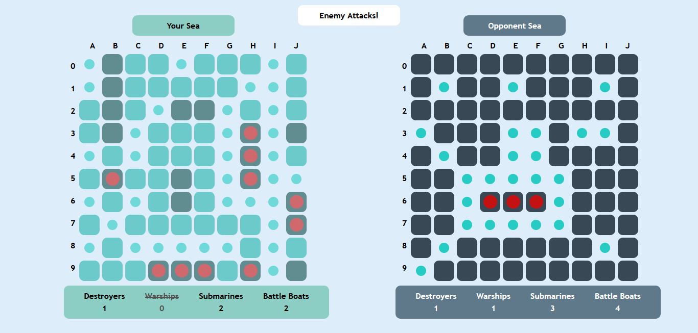

# BattleShip
Battle Ship Game
-this game was a project from the odin project course!

## Start Menu 

## Game Play

## What i learned:
-first time building using a Test Driven Development (TDD) approach  

-Got to make my own tests and use them

-Got more practice with ES6 modules structure and importing and exporting modules